## Hi there 👋

Everything should be as simple as possible.

### 🌱 Open Source Contributions

| Project | PR | Project | PR |
| --- | --- | --- | --- |
|  <a href="https://github.com/llvm/llvm-project"><strong>LLVM</strong></a> | [#205854](https://github.com/llvm/llvm-project/pull/205854), [#199104](https://github.com/llvm/llvm-project/pull/199104), [#202105](https://github.com/llvm/llvm-project/pull/202105) [#199112](https://github.com/llvm/llvm-project/pull/199112), [#199098](https://github.com/llvm/llvm-project/pull/199098), [#206011](https://github.com/llvm/llvm-project/pull/206011) [#205988](https://github.com/llvm/llvm-project/pull/205988), [#206041](https://github.com/llvm/llvm-project/pull/206041), [#206270](https://github.com/llvm/llvm-project/pull/206270) [#208788](https://github.com/llvm/llvm-project/pull/208788), [#205873](https://github.com/llvm/llvm-project/pull/205873), [#199103](https://github.com/llvm/llvm-project/pull/199103) [#208975](https://github.com/llvm/llvm-project/pull/208975), [#209190](https://github.com/llvm/llvm-project/pull/209190) |  <a href="https://github.com/flagos-ai/FlagGems"><strong>FlagGems</strong></a> | [#3421](https://github.com/flagos-ai/FlagGems/pull/3421) [#4258](https://github.com/flagos-ai/FlagGems/pull/4258) |

### ⚙️ Languages, Debugging & Performance Tools

  
  
  
  
  

  
  
  
  

  
  

